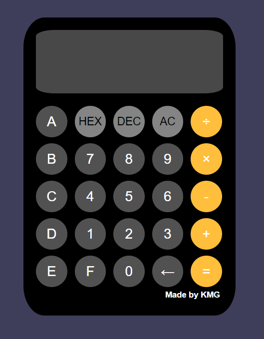
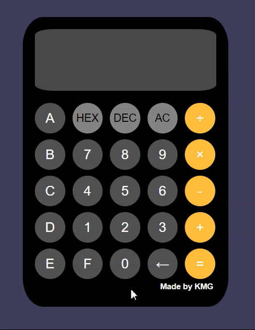
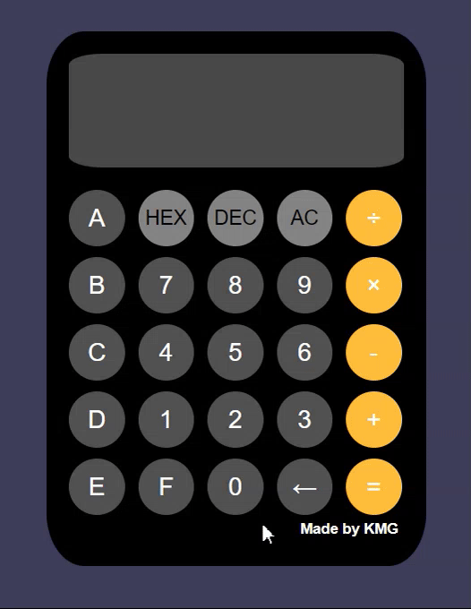
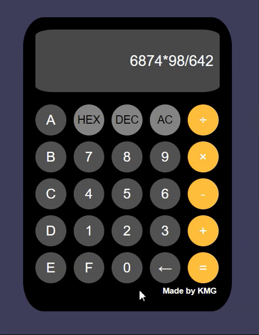
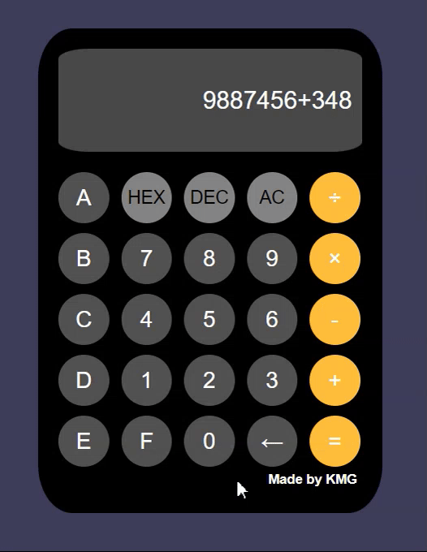
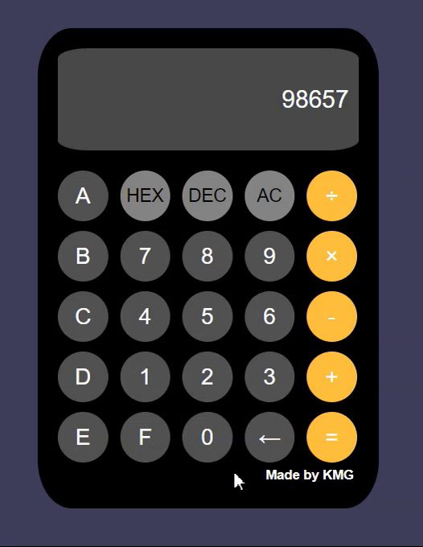
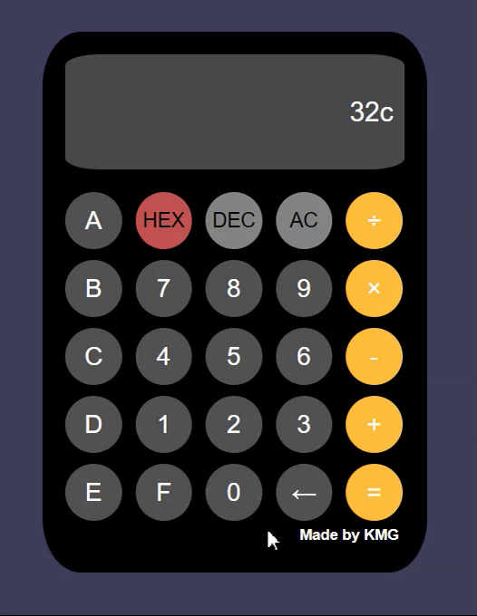
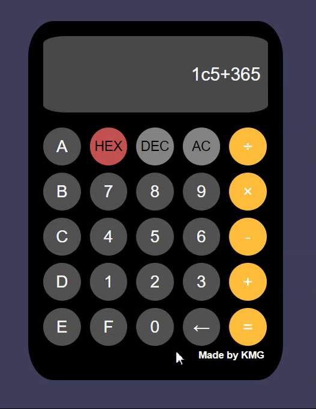
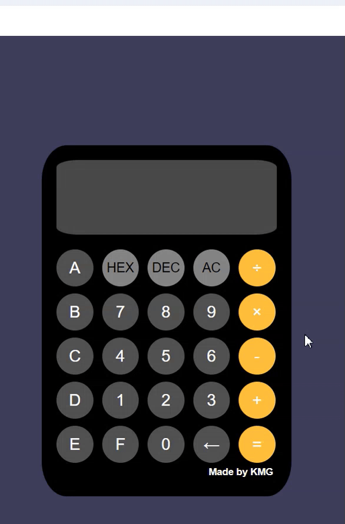

## FrontEnd 단위평가

### 프로젝트 주제: HTML, CSS, JS 계산기

1. **HTML 파일**

```html
<!DOCTYPE html>
<html lang="en">
<head>
    <meta charset="UTF-8">
    <meta name="viewport" content="width=device-width, initial-scale=1.0">
    <title>계산기</title>
    <link rel="stylesheet" href="styles.css">
</head>
<body>
    <div class="calculator">
        <input type="text" id="display" disabled>
        <div class="buttons">
            <button onclick="append16Binary('a')">A</button>
            <button id="HEX" class="option" onclick="changeBinary('HEX')">HEX</button>
            <button id="DEC" class="option" onclick="changeBinary('DEC')">DEC</button>
            <button class="option" onclick="clearDisplay()">AC</button>
            <button class="operator" onclick="appendOperator('/')">÷</button>

            <button onclick="append16Binary('b')">B</button>
            <button onclick="appendNumber('7')">7</button>
            <button onclick="appendNumber('8')">8</button>
            <button onclick="appendNumber('9')">9</button>
            <button class="operator" onclick="appendOperator('*')">×</button>

            <button onclick="append16Binary('c')">C</button>
            <button onclick="appendNumber('4')">4</button>
            <button onclick="appendNumber('5')">5</button>
            <button onclick="appendNumber('6')">6</button>
            <button class="operator" onclick="appendOperator('-')">-</button>

            <button onclick="append16Binary('d')">D</button>
            <button onclick="appendNumber('1')">1</button>
            <button onclick="appendNumber('2')">2</button>
            <button onclick="appendNumber('3')">3</button>
            <button class="operator" onclick="appendOperator('+')">+</button>

            <button onclick="append16Binary('e')">E</button>
            <button onclick="appendNumber('f')">F</button>
            <button onclick="appendNumber('0')">0</button>
            <button onclick="backspace()">←</button>
            <button class="operator" onclick="calculateResult()">=</button>
        </div>
        <h5>Made by KMG</h5>
    </div>
    <script src="script.js"></script>
</body>
</html>
 ```

---
2. **CSS 파일**
```css
body { /* 배경 */
    font-family: Arial, sans-serif;
    display: flex;
    justify-content: center;
    align-items: center;
    height: 100vh;
    background-color: #3e3e5a;
}

.calculator { /* 계산기 몸통*/
    background-color: rgb(0, 0, 0);
    border-radius: 10%;
    padding: 20px;
    width: 300px;
}

#display { /* 계산기 숫자 표시창 */
    width: 96%;
    height: 100px;
    font-size: 24px;
    text-align: right;
    border: none;
    margin-bottom: 20px;
    padding-right: 10px;
    color: white;
    border-radius: 10%;
    resize: none;
}

.buttons { /* 버튼 배치방식 */
    display: grid;
    grid-template-columns: repeat(5, 1fr);
    gap: 10px;
}

button { /* 일반 버튼 */
    width: 50px;
    height: 50px;
    font-size: 22px;
    color: white;
    border: none;
    background-color: #515151;
    cursor: pointer;
    border-radius: 100%;
}

.option  { /* 옵션 버튼 */
    font-size: 18px;
    color: black;
    background-color: #848484;
}

.operator  { /* 연산자 버튼 */
    background-color: #ffbe3b;
}

h5 {
    margin: 5px;
    text-align: right;
    color: white;
}
```

---
3. **자바 스크립트 파일**
```js
let binaryTypeCheck = 'DEC';

function clearDisplay() {
    document.getElementById('display').value = ''
    binaryBtnColorChange();
}

function backspace() {
    let display = document.getElementById('display').value;
    document.getElementById('display').value = display.slice(0, -1);
}

function changeBinary(binaryType) {
    let display = document.getElementById('display').value;
    if(display != '') {
        if(display.includes('=')) {
            let result = display.substr(display.indexOf('=')+1, display.length);
            display = result;
        }

        if(binaryType == 'HEX' && binaryTypeCheck == 'DEC') { // 10진수를 16진수로 변환
            var number = parseInt(display);
            document.getElementById('display').value = number.toString(16);
        }
        else if(binaryType == 'DEC' && binaryTypeCheck == 'HEX') { // 16진수를 10진수로 변환
            document.getElementById('display').value = parseInt(display, 16);
        } 
    }
    binaryBtnColorChange(binaryType);
}

function append16Binary(text) {
    document.getElementById('display').value += text;
    binaryBtnColorChange('HEX');
}

function appendNumber(number) {
    let display = document.getElementById('display').value;
    if(display.includes('=')) {
        calculateResultAfter(display, number)
    }
    else {
        document.getElementById('display').value += number;
    }
}

function appendOperator(operator) {
    let display = document.getElementById('display').value;
    if(display.includes('=')) {
        calculateResultAfter(display, operator)
    }
    else if(display == '' && (operator == '*' || operator == '/')) {
        alert('연산자로 식을 시작할 수 없습니다.');
    }
    else {
        document.getElementById('display').value += operator;
    }
}

function calculateResult() {
    try {
        let display = document.getElementById('display').value;
        if(display != '') {
            if(binaryTypeCheck == 'HEX') {
                let displayBinaryReplace = display.replace(/[0-9a-fA-F]+/g, function (match) {
                    return parseInt(match, 16);  // 각 16진수 문자열을 10진수로 변환
                });
                let result = new Function('return ' + displayBinaryReplace)();
                document.getElementById('display').value +=  ('= ' + result.toString(16)); // 16진수로 표현
                binaryBtnColorChange('HEX');
            }
            else {
                let result = new Function('return ' + display)();
                document.getElementById('display').value += ('= ' + result);
                binaryBtnColorChange('DEC');
            }
        }
        else {
            alert('식이 입력되지 않았습니다.')
        }
    }
    catch {
        alert('식이 완성되지 않았습니다.')
    }    
}

function calculateResultAfter(display, text) { // 식에 '=' 연산자가 포함되어 있으면 결과값에만 숫자/연산자를 추가 
    let result = display.substr(display.indexOf('=')+1, display.length);
    document.getElementById('display').value = result + text;
}


function binaryBtnColorChange(binaryType) { // 진수 설정에 따라 버튼의 색을 변경
    if(binaryType == 'HEX') {
        document.getElementById("HEX").style.backgroundColor="#c35252";
        document.getElementById("DEC").style.backgroundColor="#848484";
        binaryTypeCheck = 'HEX';
    }
    else if(binaryType == 'DEC') {
        document.getElementById("DEC").style.backgroundColor="#c35252";
        document.getElementById("HEX").style.backgroundColor="#848484";
        binaryTypeCheck = 'DEC';
    }
    else {
        document.getElementById("DEC").style.backgroundColor="#848484";
        document.getElementById("HEX").style.backgroundColor="#848484";
        binaryTypeCheck = 'DEC';
    }
}
```

---
4. **GUI 및 동작확인**

▼ 계산기 GUI



▼ 숫자 입력 및 계산 (10진수)



▼ 숫자 입력 및 계산 (16진수)



▼ 백스페이스



▼ 리셋



▼ 10진수를 16진수로 변환



▼ 16진수를 10진수로 변환



▼ 10진수 계산값을 16진수로 변환


▼ 16진수 계산값을 10진수로 변환



▼ 식을 연산자로 시작할 때 출력되는 알림



▼ 숫자 입력 없이 '='를 누르면 출력되는 알림


▼ 식을 완성하지 않고 '='를 누르면 출력되는 알림


